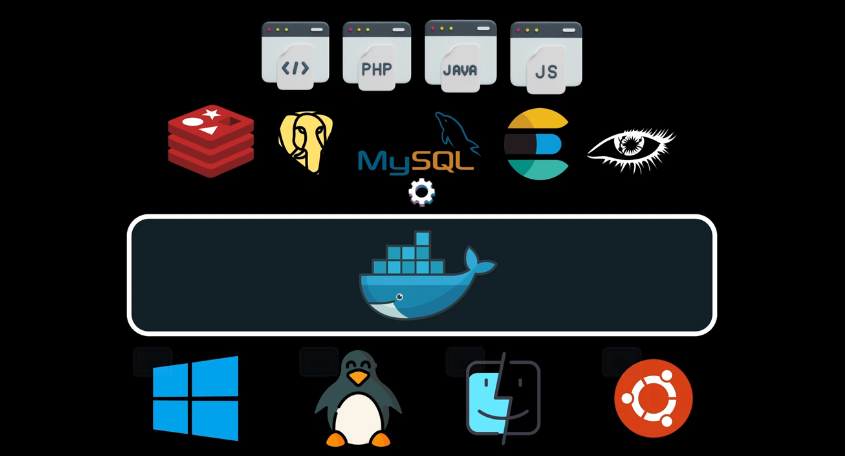
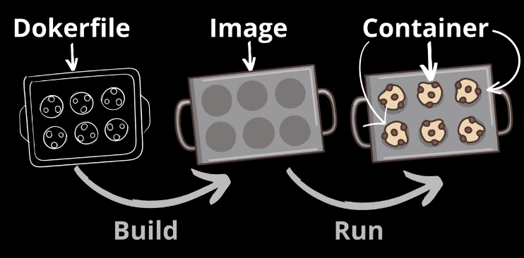
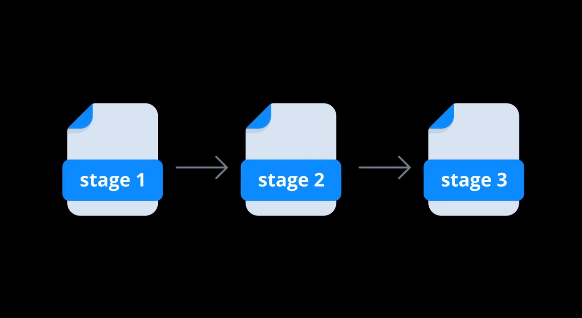

# Docker

## Введение

> **Docker** — это инструмент (программа), который упрощает процесс разработки, запуска и распространения программного обеспечения.

Проблемы, которые решает Docker:
- использование различных версий ПО и библиотек разными модулями разрабатываемого сервиса
- переносимость между различными ОС (особенно актуально для компилируемых языков программирования)
благодаря тому, что:
- каждый контейнер **изолирует** свое окружение и свои зависимости
- в каждом контейнере могут находиться **разные версии** ПО и **библиотек**, не конфликтуя между собой благодаря **изоляции** этих контейнеров.

> Docker чем-то напоминает подход Java, которая позволяет написать код один раз и он будет одинаково работать на разных ОС благодаря тому, что программа компилируется в специальный байт-код, который запускается виртуальной машиной Java (JVM) одинаково на всех платформах.

При этом Docker не только позволяет запускать программы, написанные на разных языках программирования, но и запускать целые сервисы внутри контейнеров на различных ОС.

![[Pasted image 20240610093407.png]]


Особенно полезен Docker при разработке и развертывании микросервисов совместно с Kubernetes:
- управление множеством сервисов
- непрерывное развертывание
- простые конфигурационные файлы.

## Основные понятия

**Docker Engine** — это ядро докера, с помощью него мы создаем и контейнизируем наши приложения. Docker Engine является клиент-серверным приложением, которое состоит из:

- сервера с длительно работающим процессом **`dockerd`**, который создает образы, контейнеры, тома и управляет ими.
- **API** для взаимодействия с этим процессом
- инструмент командной строки (**CLI**) для взаимодействия с сервером через предоставляемый API.

**Dockerfile** – файл с инструкциями о том как создать образ (или _image_).

**Docker image** – шаблон, на основании которого создаются и запускаются контейнеры.  
Image представляет собой просто набор файлов, директорий, символических ссылок, и необходимых инструментов.

**Docker container** – приложение, построенное на основе docker image, которое исполняется в закрытой файловой системе со своим пространством процессов.

Пример:

![[Pasted image 20240610095043.png]]


## Контейнеризация ≠ Виртуализация

- **Виртуализация** полностью эмулирует поведение операционной системы, что может привести к повышенной нагрузке на железо
- **Контейнеризация** подразумевает только переиспользование элементов из родительской системы.

## Базовые команды

Проверить, что докер установлен, можно с помощью команды `docker -v`:

```bash
 docker -v
```

Чтобы запустить контейнер, необходимо выполнить команду `docker run <name>[:<tag>]`, например, для запуска ubuntu (тег `latest` по умолчанию):

```bash
docker run ubuntu
```

Запустит контейнер на основе образа `ubuntu` самой последней версии (тег `latest`).

Если образа нет на компьютере, то он будет загружен из Docker Hub.

Контейнер завершится сразу после запуска, так как в нем нет работающего приложения.

Чтобы этого избежать, можно запустить контейнер в интерактивном режиме:
- `-i` — присоединить к контейнеру консоль ввода-вывода, при этом он продолжит работу
- `-t` — эмуляция стандартного терминала:

```bash
docker run -it ubuntu
```

Контейнер будет работать, пока интерактивный режим активен. 

Выйти из контейнера можно с помощью команды `exit`

```bash
exit
```

После этого контейнер остановится.

Посмотреть работающие контейнеры можно командой `docker ps`:

```bash
docker ps
```

Посмотреть все контейнеры (включая остановленные):

```bash
docker ps -a
```

Вывести ID всех работающих контейнеров (можно использовать для динамического получения ID контейнеров в других командах):

```bash
docker ps -q
```

Вывести ID всех контейнеров (включая остановленные):

```bash
docker ps -a -q
```

Посмотреть все образы можно с помощью команды `docker images`:

```bash
docker images
```

Запустить контейнер в detached-режиме (в фоне):

```bash
docker run -d -it ubuntu
```

Контейнер будет запущен в фоновом режиме (независимо от наличия в нем работающего приложения), будет показан ID запущенного контейнера и терминал вернется к приглашению командной строки.

Присоединиться к работающему контейнеру можно командой `attach` (необходимо указать `ID` контейнера):

```bash
docker attach 4e9fa3526059
```

Отсоединиться от контейнера (без его остановки):
`Ctrl + P` → `Ctrl + Q`.

Остановить контейнер можно командой `stop`. При этом в главный процесс (приложение) контейнера будет передан сигнал `SIGTERM`, а затем, после grace period, `SIGKILL`:

```bash
docker stop 4e9fa3526059
```

Рекомендуется обрабатывать сигналы `SIGTERM` и `SIGINT` в приложении, чтобы обеспечить так называемый graceful shutdown. Например, возможно, перед завершением работы приложения требуется что-то сохранить или выполнить какие-то действия.

Простейший пример graceful shutdown для бекенд-приложения на Node.js:

```javascript
process.on('SIGINT', () => server.close())
process.on('SIGTERM', () => server.close())
```

> `Ctrl` + `C` — `SIGINT`
> `Ctrl` + `D` — `EOF`
> `Ctrl` + `Z` — приостановить процесс (в дальнейшем можно его возобновить командами `bg` / `fg`)

Чтобы жестко остановить контейнер (будет передан сигнал `SIGKILL`):

```bash
docker kill 4e9fa3526059
```

Запустить **существующий** остановленный контейнер можно командой `start`:

```bash
docker start 4e9fa3526059
```

Перезапустить контейнер — `restart`:

```bash
docker restart 4e9fa3526059
```

Удалить контейнер:

```bash
docker rm 4e9fa3526059
```

Удалить все контейнеры:

```bash
docker rm $(docker ps -a -q)
```

Чтобы запустить контейнер с открытым (**exposed**) портом, надо передать флаг `-p <host_port>:<container_port>`:

```bash
docker run -d -p 8888:80 nginx
```

> **Открытые (exposed) порты** — основной путь взаимодействия между Docker-контейнерами.

Контейнеру можно дать имя при запуске:

```bash
docker run -d -p 8888:80 --name ngx-server nginx
```

В дальнейшем к этому контейнеру можно обращаться по данному имени:

```bash
docker stop ngx-server
docker start ngx-server
```

Посмотреть логи контейнера:

```bash
docker logs 4e9fa3526059 # все логи
docker logs -f 4e9fa3526059 # логи по мере поступления
docker logs --tail 100 4e9fa3526059 # последние 100 записей лога
```

Скачать образ (по умолчанию — из Docker Hub):

```bash
docker pull postgres:16.2
```

Удалить образ:

```bash
docker rmi postgres # по имени (тег — latest)
docker rmi postgres:16.2 # по имени и тегу
docker rmi 8e4fc9e18489 # по ID образа
```

Чтобы пушить образы на Docker Hub, необходимо авторизоваться:

```bash
docker login
```

Затем на Docker Hub необходимо создать новый репозиторий и дать ему имя. В результате репозиторий будет иметь полное имя вида: `user-name/repository-name`.

Чтобы залить локальный образ, необходимо дать ему новое имя, соответствующее полному имени удаленного репозитория:

```bash
docker tag local-name user-name/repository-name
```

По умолчанию используется тег `latest`.

Это не переименует образ, а создаст ссылку с новым именем на имеющийся образ:

```bash
docker pull hello-world
docker images
# REPOSITORY    TAG       IMAGE ID       CREATED         SIZE
# hello-world   latest    d2c94e258dcb   13 months ago   13.3kB
docker tag hello-world username/my-hello-world
docker images
# REPOSITORY                TAG       IMAGE ID       CREATED         SIZE
# hello-world               latest    d2c94e258dcb   13 months ago   13.3kB
# username/my-hello-world   latest    d2c94e258dcb   13 months ago   13.3kB
```

Затем можно загрузить образ на удаленный репозиторий:

```bash
docker push user-name/repository-name:latest
```

Чтобы собрать образ под разные платформы, необходимо вначале создать билдер:

```bash
docker buildx create --name my-builder --use --bootstrap
```

Собрать образ под разные платформы и сразу запушить его:

```bash
docker buildx build --push --platform linux/amd64,linux/arm64 -t user-name/repository-name:latest .
```

Теперь тег `latest` включает в себя образы сразу под две платформы.

Теперь можно запустить контейнер на удаленном сервере (в принципе, так же, как и на любом другом компьютере):

```bash
docker run -d -p 80:8080 --name ngx-server user-name/repository-name
```

### Volumes

> Это механизм, позволяющий хранить данные контейнера независимо от него.

Существует несколько типов volumes, в том числе сетевые.

Запустить контейнер `postgres:16.2` в detached-режиме с именем `my-postgres`, подключить к нему volume, смонтированный на `./data` в текущей ФС и на `/var/lib/postgresql/data` в ФС контейнера, передать необходимые переменные окружения:

```bash
docker run -d -p 5432:5432 --name my-postgres -v ./data:/var/lib/postgresql/data -e POSTGRES_USER='user' -e POSTGRES_PASSWORD='password' -e POSTGRES_DB='main' postgres:16.2
```

## Dockerfile

> Служит для **создания Docker-образов** на основе инструкций в файле `Dockerfile`.

- `FROM` — базовый образ  
- `WORKDIR` — рабочая директория в контейнере
- `COPY` — копирование файлов, где `.` (точка) — рабочая директория
- `VOLUME` — создает точку монтирования и отмечает ее как смонтированный диск из внешней системы или из других контейнеров
- `EXPOSE` — информирует, какой порт слушает контейнер (но не открывает его физически). Эта команда задает, какой порт нужно "опубликовать" при запуске контейнера с помощью `docker run`, используя флаг `-p` для "публикации" одного или нескольких портов, или `-P` для "публикации" всех exposed портов
- `RUN` — выполнить определенную команду при сборке образа
- `CMD` — команда для запуска приложения или параметры по умолчанию для команды `ENTRYPOINT`
- `ENTRYPOINT` — команда для запуска приложения.

Пример Dockerfile для веб-страницы в nginx:

```dockerfile
FROM nginx
WORKDIR /usr/share/nginx/html
COPY index.html .
```

Пример Dockerfile для приложения на Go:

```dockerfile
FROM golang:1.21
WORKDIR /app
COPY main.go .
RUN go build -o hello-go main.go
CMD ["./hello-go"]
```

Пример Dockerfile для бекенд-приложения на Node.js с использованием кэширования:

```dockerfile
FROM node:20.11.1

WORKDIR /app

COPY package.json .
COPY package-lock.json .

RUN npm ci

COPY index.js .

EXPOSE 8080

CMD ["node", "index.js"]
```

Чтобы использовать возможности кэширования, сначала копируем и устанавливаем зависимости, так как они меняются значительно реже, чем код (или исполняемые файлы) самого приложения. В этом случае, если зависимости не изменились, при последующей сборке они будут скопированы из кэша.

В общем случае, для использования возможностей кэширования, сначала выполняем шаги, которые затрагивают **наименее** изменяемые данные.

Пример Dockerfile для бекенд-приложения на Node.js с использованием кэширования и `.dockerignore`:

```dockerfile
FROM node:20.11.1

WORKDIR /app

COPY package.json .
COPY package-lock.json .

RUN npm ci

# копируем все файлы, а ненужные (node_modules) помещаем в .dockerignore
COPY . .

EXPOSE 8080

CMD ["node", "index.js"]
```

При этом необходим файл `.dockerignore`:

```dockerignore
node_modules/
```

При сборке указанные файлы и папки не попадут в образ.

### Сборка образа

```bash
docker build [-t <name>[:<tag>]] <dir>
```

где `dir` — директория, где находится `Dockerfile`, либо путь до конкретного `Dockerfile`.

Пример:

```bash
docker build -t go-hello:1.0 .
```

### Полный пример с Go

main.go:
```go
package main

import (
  "fmt"
  "net/http"
)

func main() {
  http.HandleFunc("/", helloWorld)
  http.ListenAndServe(":8080", nil)
}

func helloWorld(w http.ResponseWriter, _ *http.Request) {
  fmt.Fprintf(w, "Hello from Go in Docker 🐋")
}
```

Dockerfile:
```dockerfile
FROM golang:1.21
WORKDIR /app
COPY main.go .
RUN go build -o hello-go main.go
CMD ["./hello-go"]
```

Сборка образа:

```bash
docker build -t go-hello:1.0 .
```

Запуск контейнера на основе созданного образа:

```bash
docker run -d -p 5555:8080 go-hello:1.0
```

## Многоступенчатая сборка

> Основная задача **образов (docker image)** — обеспечить упаковку всех необходимых зависимостей приложения в один объект, который изолирует приложение от внешней среды и позволяет легко переносить его между различными системами.

Для компилируемых приложений осуществлять их компиляцию из исходного кода необходимо внутри контейнера в процессе сборки образа, чтобы исключить влияние собственной ОС.

> **Многоступенчатая сборка** решает проблему большого размера образов, когда в качестве базового используется образ с инструментами языка программирования, средствами компиляции и прочими зависимостями, которые нужны только на этапе сборки приложения, но не нужны для его запуска.

![[Pasted image 20240613141224.png]]


```dockerfile
FROM golang:1.21-alpine AS builder
WORKDIR /app
COPY main.go .
RUN go build -o hello-go main.go

FROM alpine:3.15
WORKDIR /app
COPY --from=builder /app/hello-go .
CMD ["./hello-go"]
```

- инструкция `AS` позволяет задать алиас (псевдоним) для образа, который в дальнейшем может быть использован в другом образе при многоступенчатой сборке
- на следующем этапе в качестве базового образа выбираем образ ОС без лишних зависимостей, например, `alpine`
	- в качестве базового образа можно использовать образ из предыдущей стадии, например: `FROM builder`, а также присвоить ему алиас: `FROM builder AS final`, чтобы уже текущий образ можно было использовать на следующей стадии и т.д.
- для копирования файлов с предыдущих стадий используется `COPY` с инструкцией `--from`, где задается алиас образа, откуда необходимо скопировать данные.

```bash
docker build -t go-hello-multistage .
docker run -p 8080:8080 go-hello-multistage
```

Полученный размер образа `go-hello-multistage` составляет `11.9MB` против `290MB` без использования многоступенчатой сборки:

```bash
docker images
```

```
REPOSITORY                TAG          SIZE
go-hello-multistage       latest       11.9MB
go-hello                  latest       290MB
```

### Buildpacks

> Проект Buildpacks предоставляет собственный инструмент автоматической сборки образа приложения на основе его исходного кода с использованием best practices, вместо того, чтобы писать собственный `Dockerfile`, который может быть не совсем оптимальным.

Сайт проекта: [Cloud Native Buildpacks · Cloud Native Buildpacks](https://buildpacks.io/).

Необходимо установить инструмент "pack CLI": [Pack · Cloud Native Buildpacks](https://buildpacks.io/docs/for-platform-operators/how-to/integrate-ci/pack/).

Например, для Ubuntu через PPA:

```bash
sudo add-apt-repository ppa:cncf-buildpacks/pack-cli
sudo apt-get update
sudo apt-get install pack-cli
```

Проверить версию:

```bash
pack --version
```

Список доступных сборщиков:

```bash
pack builder suggest
```

Пример сборки приложения:

```bash
pack build go-hello-buildpacks --builder gcr.io/buildpacks/builder:v1
```

Первый запуск займет некоторое время, но последующие сборки будут проходить быстрее.

После сборки мы получим образ `go-hello-buildpacks`, который можем запустить как обычно:

```bash
docker run -p 8080:8080 go-hello-buildpacks
```

## `docker init`

> Команда `docker init` позволяет быстро создавать все необходимые конфигурационные файлы Docker при помощи удобного интерактивного инструмента командной строки.

### `.dockerignore`

Содержит пути файлов и папок, которые **не должны** присутствовать в образе.

### `README.Docker.md`

Здесь представлена информация о том, как:
- запустить проект через `docker compose`
- собрать образ под определенную платформу и архитектуру
- выполнить деплой образа
- прочая полезная информация.

### `Dockerfile`

При построении образа обычно используется многоступенчатая сборка.

### `compose.yaml`

> Конфигурационный файл инструмента Docker Compose для сборки и запуска многоконтейнерных приложений. В дальнейшем, с помощью всего одной команды можно создать и запустить все сервисы приложения (вместо использования команд `docker build` / `docker run` с большим количеством аргументов).

Пример:

```docker-compose
version: "3.9"  # optional since v1.27.0
services:
  web:
    build: .
    ports:
      - "8000:5000"
    volumes:
      - .:/code
      - logvolume01:/var/log
    links:
      - redis
  redis:
    image: redis
volumes:
  logvolume01: {}
```

Пример команды для сборки и запуска:

```bash
docker-compose up --build
```

Вначале будут собраны образы, затем будут запущены контейнеры.

Можно прокидывать переменные окружения в контейнеры:

```bash
DB_PASSWORD=postgres docker-compose up --build
```

### Плюсы и минусы

#### Плюсы

- Стандартизация начальной настройки
- Обучение лучшим практикам
- Ускорение процесса разработки.

#### Минусы

- Ограниченная гибкость
- Риск перегрузки информацией (для новичков)
- Зависимость от шаблонов (для новичков).

## Расширенный пример фуллстек-приложения на Node.js

- фронтенд: React.js
- бекенд: Node.js + Express
- БД: PostgreSQL

### Структура

```
/data
/my-app-backend
/my-app-frontend
.env
compose.yml
```

### Бекенд

`index.js`:

```javascript
const express = require('express')
const app = express()

app.get('/', (_, res) => res.send('Hello from Node.js'))

const port = 8080

const server = app.listen(port, () => console.log(`Server started on port ${port}`))

process.on('SIGINT', () => server.close())
process.on('SIGTERM', () => server.close())
```

`.dockerignore`:

```dockerignore
node_modules/
```

`Dockerfile`:

```dockerfile
FROM node:20.11.1

WORKDIR /app

COPY package.json .
COPY package-lock.json .

RUN npm ci

COPY . .

EXPOSE 8080

CMD ["node", "index.js"]
```

Сборка образа и запуск контейнера для бекенда:

```bash
docker build -t user-name/my-app-backend .
docker run -d -p 8081:8080 --name my-app-backend user-name/my-app-backend
```

### БД

Запуск контейнера для БД:

```bash
docker run -d -p 5432:5432 --name my-app-postgres -v ./data:/var/lib/postgresql/data -e POSTGRES_USER='user' -e POSTGRES_PASSWORD='password' -e POSTGRES_DB='main' postgres:16.2
```

### Фронтенд

`.nginx/nginx.conf`:

```nginx
server {
  listen 80;
  location / {
    root /usr/share/nginx/html;
    index index.html index.htm;
    try_files $uri $uri/ /index.html =404;
  }
}
```

`.dockerignore`:

```dockerignore
node_modules/
```

`Dockerfile`:

```dockerfile
FROM node:20.11.1-alpine as build
WORKDIR /app
COPY package.json .
COPY package-lock.json .
RUN npm ci
COPY . .
RUN npm run build

FROM nginx:stable-alpine
COPY --from=build /app/build /usr/share/nginx/html
COPY --from=build /app/.nginx/nginx.conf /etc/nginx/conf.d/default.conf
EXPOSE 80
CMD ["nginx", "-g", "daemon off;"]
```

Сборка образа и запуск контейнера для фронтенда:

```bash
docker build -t user-name/my-app-frontend .
docker run -d -p 8080:80 --name my-app-frontend user-name/my-app-frontend
```

### `compose.yml` и `.env`

`.env`:

```bash
POSTGRES_USER=user
POSTGRES_PASSWORD=password
POSTGRES_DB=main
```

`compose.yml`:

```docker-compose
services:

  my-app-backend:
    image: user-name/my-app-backend
    ports:
      - 8081:8080

  my-app-frontend:
    image: user-name/my-app-frontend
    ports:
      - 8080:80

  postgres:
    image: postgres:16.2
    environment:
      POSTGRES_USER: $POSTGRES_USER
      POSTGRES_PASSWORD: $POSTGRES_PASSWORD
      POSTGRES_DB: $POSTGRES_DB
    volumes:
      - ./data:/var/lib/postgresql/data
    ports:
      - 5432:5432
```

### Команды `docker compose`

Запустить все сервисы:

```bash
docker compose up
```

Запустить все сервисы в фоне:

```bash
docker compose up -d
```

Посмотреть логи:

```bash
docker compose logs -f
```

Посмотреть логи определенного сервиса:

```bash
docker compose logs -f my-app-backend
```

Посмотреть логи нескольких сервисов:

```bash
docker compose logs -f my-app-backend my-app-frontend
```

Остановить все сервисы (контейнеры):

```bash
docker compose down
```

Остановить определенный сервис (контейнер):

```bash
docker compose down my-app-backend
```

---

- [Docker за 20 минут - YouTube](https://www.youtube.com/watch?v=Z_cUS7kCAsE)
- [Многоступенчатая сборка Docker, Jib и Buildpacks - YouTube](https://www.youtube.com/watch?v=9NqfyBcCyUs)
- [Docker init - упаковка приложений без написания Dockerfile - YouTube](https://www.youtube.com/watch?v=eDYxxv1hnEM)
- [Всё, что нужно знать о Docker | Уроки Docker - YouTube](https://www.youtube.com/watch?v=KWn3f3xJkCE)

---

#docker #cheatsheet #my #lecture #notes #compose 

