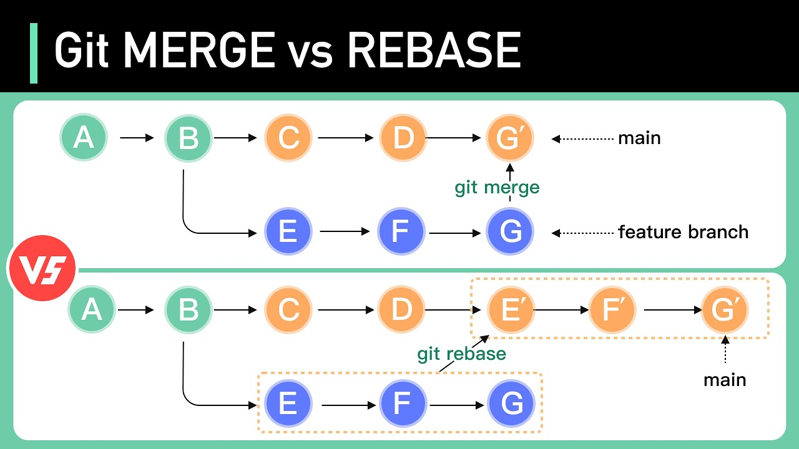

# Git

> **Git** — распределенная система контроля версий. Обеспечивает командную работу над проектом посредством фиксации изменений, веток, слияний и пр.

## Конфигурация

Конфигурация:

```bash
git config --global user.name "Alex Alexandrov"
git config --global user.email test@example.com
git config --global core.editor "vim" # установить vim редактором по умолчанию
```

Это создаст (или обновит) файл `~/.gitconfig`.

Но можно конфигурировать и локально (для папки под git):

```bash
git config user.email test123@example.com
git config core.fileMode false # игнорировать файловые права доступа (не рекомендуется)
```

В этом случае будет обновлен конфиг `./.git/config`.

## Базовая работа

```bash
git init # инициализация
git status # статус репозитория
git add file.txt # добавить файл (изменения для файла) file.txt в индекс (stage)
git add . # добавить все файлы (изменения для файлов) в текущей папке в индекс (stage)
git add -A # добавить все файлы (изменения для файлов) в рабочем каталоге в индекс (stage)
git rm --cached file.txt # удалить файл file.txt из индекса, но оставить его в рабочем каталоге (unstage + untrack)
git restore --staged file.txt # отменить изменения в индексе до состояния последнего коммита для файла file.txt (unstage)
git restore file.txt # отменить все изменения в рабочем каталоге для файла file.txt до состояния индекса — то же, что `git checkout file.txt`
git restore . # отменить все изменения в текущем каталоге до состояния индекса
git restore --source=HEAD~3 file.txt # загружает файл file.txt в рабочий каталог из 3-го коммита перед текущим (индекс не изменяется)
git restore --source=<commit-hash> file.txt # загружает файл file.txt в рабочий каталог из коммита <commit-hash> (индекс не изменяется)
git restore --source=<commit-hash> --worktree file.txt # то же, что `git restore --source=<commit-hash> file.txt`
git restore --source=<commit-hash> --staged --worktree file.txt # загружает файл file.txt и в рабочий каталог, и в индекс из коммита <commit-hash>
git clean -fd # удалить все неотслеживаемые (непроиндексированные) файлы и папки в рабочем каталоге
git commit -m "Комментарий для коммита" # зафиксировать все staged-изменения
git commit -a -m "Комментарий для коммита" # добавить все изменения в отслеживаемых файлах в индекс (stage) и сразу зафиксировать
git commit --amend # добавить изменения в последний коммит и отредактировать его сообщение в интерактивном режиме
git commit --amend -m "Комментарий для коммита" # добавить изменения в последний коммит и заменить его сообщение на новое
git commit --amend --no-edit # добавить изменения в последний коммит без редактирования его сообщения
git show <commit-hash> # показывает все изменения, содержащиеся в коммите <commit-hash>
```

## Ветки

```bash
git branch new-branch # создать ветку new-branch
git checkout -b new-branch # создать ветку new-branch и переключиться на нее
git switch -c new-branch # создать ветку new-branch и переключиться на нее (новая команда, работает только с ветками)
git switch master # переключиться на ветку master (новая команда, работает только с ветками)
git checkout master # переключиться на ветку master
git checkout file.txt # отменить все изменения в рабочем каталоге для файла file.txt до состояния индекса — то же, что `git restore file.txt`
git merge my-branch # смерджить (влить) ветку my-branch в текущую ветку
git branch -D my-branch # удалить ветку my-branch локально
git push --delete origin my-branch # удалить ветку my-branch в удаленном репозитории origin
git branch --set-upstream-to=origin/master # установить origin/master как upstream (ветку по умолчанию) для последующих пушей из текущей ветки
git branch -u origin/master # то же, что `git branch --set-upstream-to=origin/master`
git branch --set-upstream-to=origin/master my-branch # установить origin/master как upstream (ветку по умолчанию) для последующих пушей из ветки my-branch
git branch -u origin/master my-branch # то же, что `git branch --set-upstream-to=origin/master my-branch`
git branch --unset-upstream # удалить информацию об upstream (ветки по умолчанию) для последующих пушей из текущей ветки
git branch --unset-upstream my-branch # удалить информацию об upstream (ветки по умолчанию) для последующих пушей из ветки my-branch
```

## Теги

```bash
git tag v1.2.3 # создать легковесный (lightweight) тег "v1.2.3" к последнему коммиту
git tag -a v1.2.3 -m "Stable release" # создать аннотированный (annotated) тег "v1.2.3" к последнему коммиту (аннотированные теги предпочтительнее, так как более информативны)
git push origin v1.2.3 # запушить тег "v1.2.3" в удаленный репозиторий origin (это может быть не тег)
git push origin tag v1.2.3 # запушить тег "v1.2.3" в удаленный репозиторий origin (строго тег)
git push --tags # запушить все теги в удаленный репозиторий по умолчанию (обычно origin) (не рекомендуется пушить все теги таким образом)
git push origin --tags # запушить все теги в удаленный репозиторий origin (не рекомендуется пушить все теги таким образом)
git tag -d v1.2.3 # удалить тег "v1.2.3" локально
git push --delete origin v1.2.3 # удалить тег "v1.2.3" в удаленном репозитории origin (сначала необходимо удалить тег локально)
```

## Разрешение конфликтов

```bash
git checkout master # переключаемся на ветку master
git merge feature-1 # вливаем ветку feature-1
git merge feature-2 # вливаем ветку feature-2
# получаем конфликт, т.к., например, была затронута одна и та же строчка одного файла conflict-file.txt
# редактируем файл conflict-file.txt, сохраняем
git add conflict-file.txt # добавляем изменения в индекс
git merge --continue # подтверждаем слияние
```

## `.gitignore`

> Служебный файл в корне репозитория, в котором указываются пути файлов и папок, которые **не должны** попадать в коммиты.

```
file.txt
folder/
```

## `.gitkeep`

> Служебный файл, который "держит" пустую папку, чтобы она "попала" в репозиторий.

## Лог

```bash
git log # отобразить логи репозитория
git log --all --graph # отобразить все логи репозитория в виде графа
git log --all --graph --oneline # отобразить все логи репозитория в виде графа, где каждый коммит в одну строку (только название коммита и краткий хэш)
git log --pretty=format:'%h %ad | %s%d [%an]' --graph --date=short # отобразить логи репозитория в виде графа, используя кастомный формат в одну строку, с кратким отображением даты
git log --pretty=format:'%h %ad | %s%d [%an]' --graph --date=short --author=Andrew # отобразить логи репозитория для пользователя, имя которого содержит "Andrew", в виде графа, используя кастомный формат в одну строку, с кратким отображением даты
git log --pretty=format:'%h %ad | %s%d [%an]' --graph --date=short --all # отобразить все логи репозитория в виде графа, используя кастомный формат в одну строку, с кратким отображением даты
git log --graph --oneline --grep='fix' # отобразить логи с поиском по названию коммита, содержащего строку "fix" с учетом регистра
git log --graph --oneline -i --grep='fix' # отобразить логи с поиском по названию коммита, содержащего строку "fix" без учета регистра
```

Утилита `tig` предоставляет более удобный консольный интерфейс просмотра истории коммитов (работает по аналогии `htop`):

```bash
sudo apt install tig
tig
```

## `reflog`

> Отображает внутреннюю историю репозитория (все действия, включая удаленные коммиты и т.д.).

### Восстановление удаленного коммита

```bash
# допустим, случайно удалили коммит
git reset --hard HEAD~1 # жестко удалить последний коммит и привести рабочий каталог и индекс в состояние, соответствующее предыдущему коммиту (HEAD~1)

# восстановление
git reflog # отобразить внутреннюю историю (все действия, включая удаленные коммиты)
git checkout cd35885 # переключиться на коммит с хэшем "cd35885" (например, хэш удаленного коммита из reflog)
git switch -c lost # создать ветку lost и переключиться на нее
git switch master # переключиться на ветку master
git merge lost # влить ветку lost в ветку master
```

## `diff`

```bash
git diff # показывает различия между рабочим каталогом и индексом
git diff file.txt # показывает различия между рабочим каталогом и индексом только для файла file.txt
git diff <commit-hash-1> <commit-hash-2> # показывает различия между двумя коммитами
git diff <commit-hash-1> <commit-hash-2> file.txt # показывает различия в файле file.txt между двумя коммитами
git diff branch1 branch2 # показывает различия между двумя ветками
git diff --cached # показывает различия между индексом и последним коммитом (изменения, уже добавленные через `git add`)
git diff --staged # то же, что `git diff --cached`
git diff --name-only # показывает только имена измененных файлов, без содержимого
git diff --stat # показывает сводную статистику по измененным файлам (добавленные / удаленные строки)
git diff --word-diff # показывает различия на уровне слов, а не строк
```

## Работа с удаленным репозиторием

```bash
git clone git@github.com:ewwmy/timelapse-tools.git . # клонировать удаленный репозиторий в текущую папку
git remote add origin git@github.com:user-name/rep-name.git # добавить удаленный репозиторий origin для текущего локального репозитория
git remote -v # отобразить список всех удаленных репозиториев, связанных с текущим локальным репозиторием
git push --set-upstream origin master # запушить ветку master в удаленный репозиторий origin и установить origin/master как upstream (ветку по умолчанию) для последующих пушей из ветки master; если удаленная ветка origin/master не существует, она будет создана
git push -u origin master # то же, что `git push --set-upstream origin master`
git push # запушить текущую ветку в удаленный репозиторий по умолчанию (обычно origin), в ветку, установленную как upstream для текущей локальной ветки
git push --follow-tags # запушить текущую ветку, включая аннотированные и достижимые теги, в удаленный репозиторий по умолчанию (обычно origin), в ветку, установленную как upstream для текущей локальной ветки
git push -f # запушить текущую ветку в удаленный репозиторий по умолчанию (обычно origin) с перезаписью истории коммитов удаленного репозитория (например, если был выполнен git rebase или есть конфликтующие коммиты, которые нужно перезаписать)
git push origin # запушить текущую ветку в удаленный репозиторий origin, в ветку, установленную как upstream для текущей локальной ветки
git push origin master # запушить ветку master в удаленный репозиторий origin
git pull # подтянуть изменения из удаленного репозитория по умолчанию (обычно origin) из удаленной ветки, установленной как upstream, в текущую ветку (по сути это git fetch + git merge)
git pull origin # подтянуть изменения из удаленного репозитория origin из удаленной ветки, установленной как upstream, в текущую ветку
git pull origin master # подтянуть изменения из ветки master удаленного репозитория origin в текущую ветку
```

Свой удаленный репозиторий:

```bash
# на удаленном сервере
mkdir /path/to/repository.git
cd /path/to/repository.git
git init --bare # создать пустой (bare) репозиторий, который будет использоваться как удаленный репозиторий для хранения кода

# на локальном компьютере
git remote add origin user@my-server:/path/to/repository.git
git push origin master
```

Несколько удаленных репозиториев:

```bash
git remote add origin git@github.com:user-name/rep-name.git # добавить удаленный репозиторий origin
git remote add backup user@my-server:/path/to/repository.git # добавить удаленный репозиторий backup
git remote -v # посмотреть список всех связанных удаленных репозиториев

# origin  git@github.com:user-name/rep-name.git (fetch)
# origin  git@github.com:user-name/rep-name.git (push)
# backup  user@my-server:/path/to/repository.git (fetch)
# backup  user@my-server:/path/to/repository.git (push)

# получение изменений из удаленных репозиториев
git fetch origin # получение изменений из origin
git fetch backup # получение изменений из backup

# пуш в удаленные репозитории
git push origin master # пуш в origin
git push backup master # пуш в backup
```

### Группы удаленных репозиториев

Добавить в конфиг:

```ini
[remote "all"]
    url = git@github.com:user-name/rep-name.git
    url = user@my-server:/path/to/repository.git
```

Пуш во все репозитории группы:

```bash
git push all master
```

## Merge Request / Pull Request

> Это запрос на слияние веток в удаленном репозитории. Обычно делается через веб-интерфейс.

```bash
git checkout -b new-feature # создаем новую ветку и переключаемся на нее
# реализуем новый функционал
git add -A # добавляем изменения в индекс
git commit -m "New feature" # коммитим
git push --set-upstream origin new-feature # пушим ветку в удаленный репозиторий
```

GitHub, например, предлагает инструкцию, как создать pull request.

- Open a pull request — Диалог создания запроса на слияние (выбор веток, заголовок, описание)
- Create pull request — Создает запрос на слияние
- Merge pull request — Переход к диалогу коммита слияния
- Диалог коммита слияния (заголовок, описание)
- Confirm merge — Выполняет слияние и закрывает pull request
- Delete branch (опционально) — Удаляет ветку в удаленном репозитории.

```bash
git checkout master # переключаемся на ветку master
git pull # подтягиваем изменения из удаленного репозитория
git branch -D new-feature # удаляем локальную ветку (опционально)
```

Более безопасное удаление ветки:

```bash
git branch -d new-feature # флаг -d удаляет локальную ветку только если она была слита; -D принудительно удаляет ветку даже если она не была слита
```

## `cherry-pick`

> Копирование одного или нескольких коммитов из одной ветки в другую.

Более точечный перенос по сравнению с merge. Мы указываем конкретные коммиты, которые хотим перенести.

Команда переносит коммиты `<commit-hash-n>` в текущую ветку:

```bash
git cherry-pick <commit-hash-1> [<commit-hash-2> [<commit-hash-3> ...]]
```

где:

- `commit-hash-1` — более ранний коммит
- `commit-hash-3` — более новый коммит.

Пример:

- баг в одной ветке проекта
- затем баг исправили в каком-то коммите
- переносим этот коммит в текущую ветку.

```bash
git checkout -b feature-1 # создаем ветку с фичей, где затем появится баг

# возникновение бага
git add file.txt # индексируем изменения, в которых есть баг
git commit -m "Bug appeared" # коммитим

# исправление бага
git add file.txt # индексируем изменения с исправленным багом
git commit -m "Bug fixed" # коммитим: 075043cd7cf72394725149826a2c8988134efd3d

git checkout feature-2 # переключаемся на ветку с другой фичей
git cherry-pick 075043cd7cf72394725149826a2c8988134efd3d # переносим коммит, в котором баг пофиксили
```

## `stash`

> Временное сохранение незакомиченного кода в кэш.

```bash
git stash # сохранить текущие незакоммиченные изменения в кэш и вернуть рабочий каталог в состояние последнего коммита
git stash -u # то же, что `git stash`, но сохранит также неотслеживаемые файлы
git stash -a # то же, что `git stash -u`, но сохранит также игнорируемые файлы
git stash pop # вернуть последние сохраненные изменения из кэша в рабочий каталог и удалить их из кэша
```

Расширенный пример:

```bash
git stash # сохранить изменения в кэш
# делаем еще какие-то изменения
git stash # сохранить новые изменения в кэш
git stash list # показать список всех сохранений с их индексами
git stash apply stash@{1} # вернуть сохранение с индексом `stash@{1}`, не удаляя это сохранение из кэша
git stash drop stash@{1} # удалить сохранение с индексом `stash@{1}` из кэша
git stash pop stash@{3} # вернуть сохранение с индексом `stash@{3}` и удалить это сохранение из кэша
git stash branch new-branch stash@{2} # создать новую ветку new-branch, переключиться на неё и применить изменения из сохранения `stash@{2}`, после чего удалить это сохранение из кэша
```

Сохранение только отслеживаемых или только неотслеживаемых изменений:

```bash
git stash save -k "message" # сохранить только отслеживаемые изменения
git stash save --keep-index "message" # то же

git stash save -u "message" # сохранить также неотслеживаемые файлы
git stash save --include-untracked "message" # то же

git stash save -a "message" # сохранить все изменения, включая игнорируемые файлы
git stash save --all "message" # то же
```

## `reset`

> Удаление всех незакоммиченных изменений.

```bash
git reset # убрать все изменения из индекса (то есть отменить `git add`), но оставить изменения в файлах
```

```bash
git reset --hard # сбросить рабочий каталог и индекс к последнему коммиту, удалив все незакоммиченные изменения (вернуться к исходному состоянию последнего коммита, на который указывает HEAD)
git reset --hard HEAD~1 # сбросить рабочий каталог и индекс на один коммит назад, удалив все незакоммиченные изменения
git reset --hard <commit_hash> # сбросить рабочий каталог и индекс до указанного коммита, удалив все незакоммиченные изменения
git reset --hard ORIG_HEAD # сбросить рабочий каталог и индекс до состояния перед последним rebase или merge, удалив все незакоммиченные изменения (ORIG_HEAD — это указатель на коммит перед последним изменением)
```

Вернуться к состоянию удаленной ветки:

```bash
git fetch origin
git reset --hard origin/main
```

> Следует быть осторожным с `git reset --hard`, так как оно удаляет все несохраненные изменения и может привести к потере данных.

## `revert`

> Откатить коммит посредством создания нового коммита, в котором откатываются все предыдущие изменения.

```bash
git revert <commit-hash-1> [<commit-hash-2> [<commit-hash-3> ...]]
```

```bash
git revert 075043cd7cf72394725149826a2c8988134efd3d # откатить изменения, сделанные в коммите 075043cd7cf72394725149826a2c8988134efd3d (будет создан новый коммит)
```

## `rebase`

> Слияние веток с переносом коммитов в целевую ветку (как будто базовая ветка никогда не существовала отдельно). Структура веток и история коммитов перезаписываются.

```bash
git rebase master # перенос коммитов текущей ветки на вершину ветки master
git rebase master feature-1 # перенос коммитов ветки feature-1 на вершину ветки master (сокращение от `git checkout feature-1` + `git rebase master`: после выполнения feature-1 останется текущей веткой)
```

![[Git — Merge vs Rebase — Cheatsheet.png]]


Часто вызывает конфликты, но позволяет сделать историю линейной.

> Рекомендуется запретить `rebase` в главной ветке проекта.

### Интерактивный `rebase`

```bash
git rebase -i HEAD~3 # перебазировать 3 последних коммита в интерактивном режиме
```

Будет предложено вручную выполнить различные манипуляции с коммитами:

```
pick bc4bc3a Commit 1
pick dc4ab83 Commit 2
pick 0704370 Commit 3
```

Основные опции:

- `pick`, `p` `<commit-hash>` — выбрать коммит для перебазирования
- `reword`, `r` `<commit-hash>` — выбрать коммит для перебазирования и отредактировать сообщение коммита
- `squash`, `s` `<commit-hash>` — объединить коммит с предыдущим
- `drop`, `d` `<commit-hash>` — удалить коммит.

## Обслуживание репозитория

```bash
git maintenance start # начать обслуживать репозиторий (будут выполняться различные операции с разной периодичностью, можно настраивать через конфиг)
git maintenance stop # прекратить обслуживать репозиторий
```

## `worktree`

> Позволяет создавать дополнительные рабочие каталоги для одного репозитория, что позволяет одновременно работать с разными ветками или состояниями, не делая `stash` или промежуточные коммиты.

Основная идея в том, что с помощью `git worktree` можно работать с несколькими рабочими копиями репозитория параллельно, например, с разными ветками, без необходимости сохранять изменения в основном рабочем каталоге.

```bash
git worktree add ../new-feature-worktree -b new-feature master # создает новый рабочий каталог текущего репозитория в папке ../new-feature-worktree с созданием новой ветки new-feature от ветки master текущего репозитория

cd ../new-feature-worktree # переходим в новый рабочий каталог
echo "hello" > file.txt # создаем новый файл в ветке new-feature
git add file.txt # добавляем новый файл в индекс
git commit -m "New feature in new worktree" # коммитим

cd ../first-repo # переходим в основной рабочий каталог (ветка master)
git merge new-feature # вливаем ветку new-feature в master

rm -rf ../new-feature-worktree # новый рабочий каталог можно просто удалить
```

---

- [Как использовать Git? Практическое руководство | Уроки Git - YouTube](https://www.youtube.com/watch?v=Sj5jdTxmfKg)
- [Команды git которые стоит использовать: switch, restore, maintenance, worktree - YouTube](https://www.youtube.com/watch?v=Q4fGRm0EUP4)

---

#lecture #notes #git #cheatsheet #my
