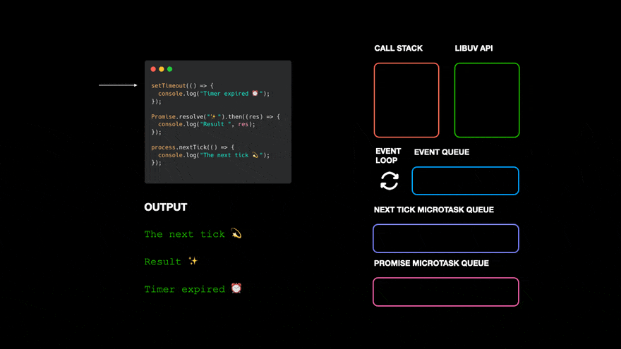
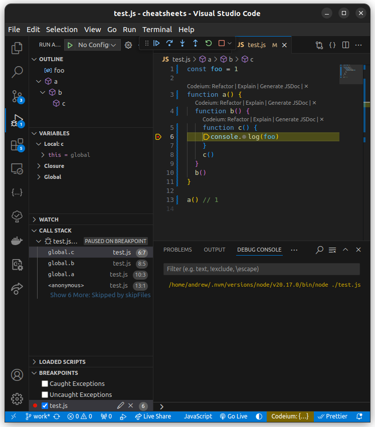

# Node.js

## Intro

- Easy to swtich between frontend and backend
  - Developers who know JavaScript can easily work on both
- Common codebase for frontend and backend
- Variety of packages

## Installation

### `nvm`

> Node version manager.

- Conveniently install new Node.js versions
- Easily switch between installed versions
- Isolated enviroments for different versions

## Basics

### JavaScript runtimes

#### Browser vs Node.js

| Browser                            | Node.js                                  |
| ---------------------------------- | ---------------------------------------- |
| Frontend                           | Server-side                              |
| Browser API (`DOM`, `window`, ...) | Node API (`fs`, `http`, ...)             |
| JS version is not guaranteed       | JS version is defined by Node.js version |
| ES Modules                         | CommonJS, ES Modules                     |

Alternate server-side JavaScript runtimes:

- Deno
- Bun

### REPL

```bash
node
```

> Usecase: test regexps.

### Run JS files

```bash
node app.js
```

### Modules

Why modules?

- Reuse
- Compose
- Convenient collaboration
- Isolation
- Structure

#### Module types

- **IIFE (Immediately Invoked Function Expression)**: `;(function() {})()`
  - Browser
- **CommonJS**: `const foo = require('./foo.js')`
  - Browser (bundle)
  - Node.js
- **ES Modules**: `import { foo } from './foo.js'`
  - Browser
  - Node.js

#### CommonJS

```javascript
// foo.js
const a = 1
function b() {
  return 2
}
module.exports = { a, b }

// bar.js
const { a, b } = require('./foo.js')
console.log(a + b()) // 3
```

##### Default-like export

```javascript
// foo.js
function bar() {
  console.log('bar')
}
module.exports = bar

// baz.js
const qux = require('./foo.js')
qux() // 'bar'
```

##### Conditional import

```javascript
if (foo) {
  const { bar } = require('./baz.js')
  // ...
}
```

#### ES Modules

```javascript
// foo.js
export const a = 1
export function b() {
  return 2
}

// bar.js
import { a, b } from './foo.js'
console.log(a + b()) // 3
```

##### Variants of import

```javascript
// foo.js
export const a = 1
export function b() {}
export default class C {}

// bar.js
import { a, b } from './foo.js' // import `a` and `b`
import { a as first, b as second } from './foo.js' // import `a` and `b` as aliases
import * as foo from './foo.js' // import everything as `foo`
import Qux from './foo.js' // import default as `Qux`
// import { a, b as second }, * as foo, Qux from './foo.js' // can be combined in one line

a
b()
first
second()
foo.a
foo.b()
new Qux()
```

##### Async import

```javascript
;(async function () {
  const { a, b } = await import('./foo.js')
})()
```

Error handling is supported:

```javascript
;(async function () {
  try {
    const { a, b } = await import('./foo.js')
  } catch {
    console.error('Cannot load the module')
  }
})()
```

##### How to turn on ES Modules

Either:

- Use `.mjs` extension
- `"type": "module"` in `package.json`
- `--input-type=module` as a command-line argument of `node`

#### Import JSON files

CommonJS:

```javascript
const data = require('./data.json')
```

ES Modules:

```javascript
import data from './data.json' assert { type: 'json' } // sync
;(async () => {
  const data = await import('./data.json', { assert: { type: 'json' } }) // async
})()
```

#### CommonJS vs ES Modules

| CommonJS `require`          | ES Modules `import`          |
| --------------------------- | ---------------------------- |
| Available anywhere          | Only at the top              |
| Сan be used in conditions   | Сannot be used in conditions |
| Executes entire file        | Imports only what's needed   |
| No async (blocks execution) | Async load is supported      |

### Global and Modular variables

```javascript
// globals
global // root object
console
performance
setTimeout
setInterval
setImmediate
Event
EventTarget
Buffer
URL
URLSearchParams
TextEncoder
TextDecoder
MessageChannel
MessageEvent
MessagePort
// ...

// modulars
__dirname // absolute path to the directory of the current module file
__filename // absolute path to the current module file
exports
module
require()
```

### Events

| `EventEmitter`                                   | `EventTarget`                                       |
| ------------------------------------------------ | --------------------------------------------------- |
| From `events` module                             | From `globals`                                      |
| Multiple listeners for one event                 | Only one listener for one event                     |
| Compatible with browser `EventEmitter` API       | Partially compatible                                |
| Error handling on `error` event                  | No built-in error handling on `error` event         |
| Built-in events on adding and removing listeners | No built-in events on adding and removing listeners |

#### How it works

```javascript
const EventEmitter = require('events')
const emitter = new EventEmitter()

emitter.on('data', () => {})
emitter.on('data', handlerFoo)
emitter.on('data', handlerBar)

emitter.on('close', someHandler)
emitter.on('close', data => console.log(data))
emitter.on('close', foo)
```

| Event name | Order | Listener function           |
| ---------- | ----- | --------------------------- |
| `'data'`   | 1     | `() => {}`                  |
|            | 2     | `handlerFoo`                |
|            | 3     | `handlerBar`                |
| `'close'`  | 1     | `someHandler`               |
|            | 2     | `data => console.log(data)` |
|            | 3     | `foo`                       |

#### Examples

```javascript
const EventEmitter = require('events')
const emitter = new EventEmitter()

const hello = () => console.log('Hello!')
const bye = () => console.log('Goodbye!')
const helloName = name => console.log(`Hello, ${name}!`)

// adding listeners
emitter.addListener('greet', hello)
emitter.on('greet', bye)
emitter.on('greetAlt', helloName)

// adding listeners in the beginning of the list
emitter.prependListener('greet', () => console.log('👋'))

// emitting events
emitter.emit('greet') // 👋 ⏎ Hello! ⏎ Goodbye!
emitter.emit('greetAlt', 'Alice') // Hello, Alice!

// removing listeners
emitter.removeListener('greet', hello)
emitter.off('greetAlt', helloName)

// emitting again
emitter.emit('greet') // 👋 ⏎ Goodbye!
emitter.emit('greetAlt', 'Alice') // _

// removing all listeners for an event
emitter.removeAllListeners('greet')

// removing all listeners
emitter.removeAllListeners()

// one-time listener
emitter.once('greetOnce', name => console.log(`Once: Hello, ${name}!`))
emitter.emit('greetOnce', 'Bob') // Once: Hello, Bob!
emitter.emit('greetOnce', 'Charlie') // _

// max listeners
emitter.setMaxListeners(5)
emitter.getMaxListeners() // Default is 10

// listeners count
emitter.listenerCount('greet')

// listeners array
emitter.listeners('greet')

// event names
emitter.eventNames()

// handling events on adding/removing listeners
emitter.on('newListener', (event, listener) =>
  console.log(`Added listener "${listener}" for "${event}" event`)
)
emitter.on('removeListener', (event, listener) =>
  console.log(`Listener "${listener}" removed from "${event}" event`)
)

// error handling
emitter.on('error', err => console.log(`Error: ${err.message}`))
emitter.emit('error', new Error('Something went wrong')) // Error: Something went wrong
```

## Advanced concepts

### Architecture of Node.js


#### Animated example



### Event Loop

```
     ┌───────────────────────────┐
     │       initialization      │   Synchronous code, `require`, register callbacks
     └─────────────┬─────────────┘
     Microtasks: nextTick, Promises
┌─────────────────>│
│    ┏━━━━━━━━━━━━━┷━━━━━━━━━━━━━┓
│    ┃           timers          ┃   Executes setTimeout and setInterval callbacks
│    ┗━━━━━━━━━━━━━┯━━━━━━━━━━━━━┛
│    Microtasks: nextTick, Promises
│    ┌─────────────┴─────────────┐
│    │     pending callbacks     │   Executes system callbacks from previous I/O
│    └─────────────┬─────────────┘
│    Microtasks: nextTick, Promises
│    ┌─────────────┴─────────────┐
│    │       idle, prepare       │   Internal preparation steps
│    └─────────────┬─────────────┘
│    Microtasks: nextTick, Promises        ┌───────────────┐
│    ┏━━━━━━━━━━━━━┷━━━━━━━━━━━━━┓         │   incoming:   │
│    ┃           poll            ┃ <───────┤  connections, │   Main phase for I/O events
│    ┗━━━━━━━━━━━━━┯━━━━━━━━━━━━━┛         │   data, etc.  │
│    Microtasks: nextTick, Promises        └───────────────┘
│    ┏━━━━━━━━━━━━━┷━━━━━━━━━━━━━┓
│    ┃           check           ┃   Executes setImmediate callbacks
│    ┗━━━━━━━━━━━━━┯━━━━━━━━━━━━━┛
│    Microtasks: nextTick, Promises
│    ┏━━━━━━━━━━━━━┷━━━━━━━━━━━━━┓
│    ┃      close callbacks      ┃   Executes close event callbacks
│    ┗━━━━━━━━━━━━━┯━━━━━━━━━━━━━┛
│    Microtasks: nextTick, Promises
│    ┌─────────────┴─────────────┐
└─no─┤           exit?           │   Checks whether the program is finished
     └─────────────┬─────────────┘
                  yes
     ┌─────────────┴─────────────┐
     │           finish          │
     └───────────────────────────┘
```

- Heavy synchronous operations prevent the Event Loop from starting; it won't begin until the call stack is empty.
- Heavy asynchronous operations should be moved out of the main thread, for example, into worker threads, to avoid blocking the Event Loop.

### Timers

> Timers don't guarantee exact timing because of the Event Loop. The more the Event Loop is loaded, the greater the delay may be.

```javascript
// a callback
const greet = (name, emoji) => console.log(`Hello, ${name}! ${emoji}`)

// executes a callback once after a delay (ms)
setTimeout(() => console.log('Timeout'), 1000) // 'Timeout' after 1 sec.
setTimeout(greet, 5000, 'Alice', '👋') // 'Hello, Alice! 👋' after 5 sec.

// executes a callback once after a delay (ms) and saves the timer id into a variable
const timeout = setTimeout(() => console.log('Timeout'), 1000)
// cancels a timeout
clearTimeout(timeout)

// executes a callback repeatedly with a fixed delay (ms) and saves the timer id into a variable
const interval = setInterval(() => console.log('Interval'), 1000)
// cancels an interval
clearInterval(interval)

// executes a callback immediately after I/O events and saves the timer id into a variable
const immediate = setImmediate(() => console.log('Immediate'))
// cancels an immediate
clearImmediate(immediate)

// `ref` and `unref` usage
const anotherTimer = setTimeout(() => {
  console.log('Timeout is reached')
}, 3000)

// the timeout is unset
anotherTimer.unref()

// reactivates the timer if the event loop is still active at `check` phase
setImmediate(() => {
  anotherTimer.ref()
})
// 'Timeout is reached' after 3 sec.
```

### Event Loop examples

#### Simple example

```javascript
console.log(1) // synchronous

setTimeout(() => {
  console.log(2) // timer
}, 0)

process.nextTick(() => {
  console.log(3) // nextTick
})

Promise.resolve()
  .then(() => {
    console.log(4) // microtask - promise
  })
  .then(() => {
    console.log(5) // another microtask within the same promise
  })

setImmediate(() => {
  console.log(6) // immediate
})

console.log(7) // synchronous

// 1, 7, 3, 4, 5, 2, 6
```

#### Extended example

```javascript
console.log(1) // synchronous

setTimeout(() => {
  console.log(2) // synchronous inside the timer
  process.nextTick(() => {
    console.log(3) // nextTick inside the timer
  })

  new Promise(resolve => {
    console.log(4) // synchronous inside the promise
    resolve()
  })
    .then(() => {
      console.log(5) // then for the first promise
      return new Promise(resolve => {
        console.log(6) // synchronous inside the second promise
        resolve()
      })
    })
    .then(() => {
      console.log(7) // then for the second promise
    })
}, 0)

setImmediate(() => {
  console.log(8) // immediate
})

new Promise(resolve => {
  console.log(9) // synchronous inside the promise
  resolve()
})
  .then(() => {
    console.log(10) // first then for the promise
  })
  .then(() => {
    console.log(11) // second then for the promise
  })

// 1, 9, 10, 11, 2, 4, 3, 5, 6, 7, 8
```

### Call stack and Debug mode

```javascript
const foo = 1

function a() {
  function b() {
    function c() {
      console.log(foo)
    }
    c()
  }
  b()
}

a() // 1
```



### Performance

```javascript
const { performance, PerformanceObserver } = require('perf_hooks')

// // // performance basic usage
const start = performance.now()
// ... slow code ...
console.log(performance.now() - start)

// // // performance measurement with marks
performance.mark('start')
// ... slow code ...
performance.mark('end')
performance.measure('slow', 'start', 'end') // label, mark1, mark2
console.log(performance.getEntriesByName('slow'))

// // // performance measurement with observer for `measure` type
const measureObs = new PerformanceObserver((items, observer) => {
  console.log(items.getEntries()) // all entries
  console.log(items.getEntriesByName('slow')) // entries by name
  console.log(items.getEntriesByType('measure')) // entries by type
  observer.disconnect()
})
measureObs.observe({ entryTypes: ['measure'] }) // 'dns', 'function', 'gc', 'http', 'http2', 'mark', 'measure', 'net', 'node', 'resource'

// // // performance measurement with observer for `function` type
function slow() {
  // ... slow code ...
}
slow = performance.timerify(slow)

const funcObs = new PerformanceObserver((items, observer) => {
  console.log(items.getEntries()) // all entries
  observer.disconnect()
})
funcObs.observe({ entryTypes: ['function'] }) // types of entries that we observe

// // // high-resolution timing for a function
console.time('label')
// ... slow code ...
console.timeEnd('label')

// // // inspecting event loop lag
const start = Date.now()
setImmediate(() => {
  const lag = Date.now() - start
  console.log(`Event Loop Lag: ${lag}ms`)
})

// // // memory usage
console.log(process.memoryUsage()) // { rss, heapTotal, heapUsed, external, arrayBuffers }
```

## Multi-threading

### Worker threads

- Node.js is a single-threaded environment, but it can use **Worker Threads** for multithreading to offload heavy computations.
- `libuv` has a default thread pool of **`4` threads** to handle asynchronous I/O operations, but it can be expanded up to **`1024` threads** using the `UV_THREADPOOL_SIZE` environment variable.

> Not every asynchronous operation uses **Worker Threads**.

**Worker Threads:**

- All filesystem operations with `fs.*`
- `dns.lookup()`
- Pipes (in some cases)
- CPU-intensive calculations

**OS-level Async Calls:**

- TCP / UDP server and client
- `http` / `https` client
- `dns.resolve()`
- Pipes
- `child_process`

Demonstrates that OS-level async calls operate independently of `UV_THREADPOOL_SIZE`, thus, requests are processed almost in parallel:

```javascript
const https = require('https')

const start = performance.now()

// number of threads can be set with `UV_THREADPOOL_SIZE` environment variable
process.env.UV_THREADPOOL_SIZE = 4

// https uses OS-level async calls
for (let i = 0; i < 32; i++) {
  https.get('https://example.com', res => {
    res.on('data', () => {})
    res.on('end', () => {
      console.log(performance.now() - start) // ~ 1000 1001 1003 1007 1008 1010 1011 1015 ...
    })
  })
}
```

Highlights the effect of `UV_THREADPOOL_SIZE`, showing output in batches, because only four threads can run in parallel when `UV_THREADPOOL_SIZE=4`:

```javascript
const crypto = require('crypto')

const start = performance.now()

// number of threads can be set with `UV_THREADPOOL_SIZE` environment variable
process.env.UV_THREADPOOL_SIZE = 4

// crypto uses worker threads
for (let i = 0; i < 32; i++) {
  crypto.pbkdf2('test', 'salt', 100000, 64, 'sha512', (err, key) => {
    console.log(performance.now() - start) // ~ 60 61 63 63 (x4)   118 119 119 120 (x4) ...
  })
}
```

#### Usage of Worker Threads

```javascript
// ./workers/compute.js
const { parentPort, workerData } = require('worker_threads')

const compute = ({ items }) =>
  items.map(num => {
    for (let i = 0; i < 1e9; i++) Math.sqrt(i) // imitation of cpu-intensive calculation
    return num ** 2
  })

parentPort.postMessage(compute(workerData))

// ./index.js
const { Worker } = require('worker_threads')

const computeWrapper = items => {
  return new Promise((resolve, reject) => {
    const worker = new Worker('./workers/compute.js', {
      workerData: {
        items,
      },
    })

    worker.on('message', msg => resolve(msg))
    worker.on('error', err => reject(err))
    worker.on('exit', () => console.log('Finished'))
  })
}

const main = async () => {
  try {
    performance.mark('start')

    const result = await Promise.all([
      computeWrapper([57, 31, 85, 48, 63, 92, 74, 59, 21]),
      computeWrapper([33, 67, 29, 50, 88, 41, 93, 77, 25]),
      computeWrapper([96, 45, 20, 58, 34, 99, 74, 89, 22]),
      computeWrapper([49, 27, 38, 97, 91, 53, 85, 32, 61]),
    ])
    console.log(result)

    performance.mark('end')
    performance.measure('main', 'start', 'end')
    console.log(performance.getEntriesByName('main').pop())
  } catch (error) {
    console.error(`Error: ${error?.message}`)
  }
}

main()
```

> ❗ Make sure you don't create worker threads on each web server connection! Create limited set of worker threads for that purpose instead.

### `exec`

```javascript
const { exec } = require('child_process')

const childProcess = exec('ls', (err, stdout, stderr) => {
  if (err) {
    console.error(`Error: ${err?.message}`)
  }
  console.log(`Stdout: ${stdout}`)
  console.log(`Stderr: ${stderr}`)
})

childProcess.on('exit', exitCode => {
  console.log(`Child process exited with code: ${exitCode}`)
})
```

### `spawn`

```javascript
const { spawn } = require('child_process')

const childProcess = spawn('ls')

childProcess.stdout.on('data', data => {
  console.log(`Stdout: ${data}`)
})

childProcess.stderr.on('data', data => {
  console.log(`Stderr: ${data}`)
})

childProcess.on('error', err => {
  console.error(`Error: ${err?.message}`)
})

childProcess.on('exit', exitCode => {
  console.log(`Child process exited with code: ${exitCode}`)
})
```

### `fork`

> `fork` is used to create a child process in Node.js that runs a specified JavaScript file in a separate Node.js instance.

```javascript
// ./fork.js
process.on('message', msg => {
  if (msg === 'disconnect') {
    process.disconnect()
    return
  }
  console.log(`Fork process recieved: ${msg}`)
  process.send('pong')
})

// ./index.js
const { fork } = require('child_process')

const forkProcess = fork('./fork.js')

forkProcess.on('message', msg => {
  console.log(`Main process recieved: ${msg}`)
})

forkProcess.on('close', statusCode => {
  console.log(`Exited: ${statusCode}`)
})

forkProcess.send('ping')
forkProcess.send('disconnect')
```

### Worker Thread vs Fork

| Worker Thread                                      | Fork                                                              |
| -------------------------------------------------- | ----------------------------------------------------------------- |
| Uses a thread within the same Node.js process      | Creates a new Node.js process                                     |
| Shares memory with the main thread                 | Isolates memory; uses IPC for communication with the main process |
| Lightweight and efficient for CPU-bound tasks      | Heavier and better suited for independent processes or tasks      |
| Can communicate directly with other Worker Threads | Forked processes cannot communicate directly with each other      |

- Worker Threads are ideal for parallelizing CPU-bound tasks without incurring the overhead of creating a new process. They exist within the same memory space as the main thread, which allows faster data exchange (no need for serialization or deserialization).
- Fork creates a completely separate process with its own memory space. This process communicates with the main process through Inter-Process Communication (IPC). Forked processes are useful for running fully isolated instances of Node.js, like independent servers or script runners.

> For frequent or large data transfers, use Worker Threads. IPC has limitations with very large data transfers (~200 MB) and may cause errors when exceeding buffer capacity. Additionally, creating threads is less resource-intensive than creating separate processes.

## V8

### Compilation stages

```
┌─────────────────┐      ┌─────────┐      ┌──────────────┐      ┌──────────────────┐
│   Source code   │─────>│   AST   │─────>│   Bytecode   │─────>│   Machine code   │
└─────────────────┘      └─────────┘      └──────────────┘      └──────────────────┘
```

#### AST

AST can be reviewed using the modern web service [AST explorer](https://astexplorer.net/).

##### Example

Source code:

```javascript
let items = ['one', 'two', 'three']

function printItems() {
  items.forEach((item, key) => console.log(`Item ${key}:` + item))
}
```

AST (simplified):

```
Program {
  body: [
    VariableDeclaration {
      declarations: [
        VariableDeclarator {
          id: Identifier {
            name: "items"
          }
          init: ArrayExpression {
            elements: [
              Literal {
                value: "one"
                raw: "'one'"
              }
              Literal {
                value: "two"
                raw: "'two'"
              }
              Literal {
                value: "three"
                raw: "'three'"
              }
            ]
          }
        }
      ]
      kind: "let"
    }
    FunctionDeclaration {
      id: Identifier {
        name: "printItems"
      }
      expression: false
      generator: false
      async: false
      params: []
      body: BlockStatement {
        body: [
          ExpressionStatement {
            ...
          }
        ]
      }
    }
  ]
  sourceType: "module"
}
```

#### Bytecode

```bash
node --print-bytecode ./app.js
```

```javascript
// ./app.js
const main = () => {
  const a = 3
  return a * 5
}
main()
```

```
...

[generated bytecode for function: main (0x3dd5bfc5b559 <SharedFunctionInfo main>)]
Bytecode length: 7
Parameter count 1
Register count 1
Frame size 8
Bytecode age: 0
   33 S> 0x3dd5bfc5c01e @    0 : 0d 03             LdaSmi [3]
         0x3dd5bfc5c020 @    2 : c4                Star0
   46 S> 0x3dd5bfc5c021 @    3 : 46 05 00          MulSmi [5], [0]
   49 S> 0x3dd5bfc5c024 @    6 : a9                Return
Constant pool (size = 0)
Handler Table (size = 0)
Source Position Table (size = 8)
0x3dd5bfc5c029 <ByteArray[8]>
```

### How V8 works

```
┌─────────────────┐      ┌────────────┐      ┌─────────┐
│   Source code   │─────>│   Parser   │─────>│   AST   │
└─────────────────┘      └────────────┘      └─────────┘
                                                  │
        ┌─────────────────────────────────────────┘
        V
┌──────────────┐
│   Ignition   │      ┌──────────────┐
│  interpreter │─────>│   Bytecode   │
└──────────────┘      └──────────────┘
                             │
                             └──────────────────┐
                                                V
┌──────────────┐                        ┌──────────────┐
│   TurboFan   │<╴╴╴╴╴optimization╶╶╶╶╶╶│   Sparkplug  │
│   compiler   │╴╴╴╴╴deoptimization╶╶╶╶>│   compiler   │
└──────────────┘                        └──────────────┘
       │                                        │
       V                                        V
┌──────────────┐                       ┌─────────────────┐
│  Optimized   │                       │  Non-optimized  │
│ machine code │╴╴╴╴╴╴╴╴╴╴╴╴╴╴╴╴╴╴╴╴╴╴╴│  machine code   │
└──────────────┘                       └─────────────────┘
```

- **Parser**: Converts the source code into an Abstract Syntax Tree (**AST**).
- **Ignition Interpreter**: Converts the AST into **bytecode** for fast interpretation.
- **Sparkplug Compiler**: Compiles **bytecode** into **non-optimized machine code**, improving performance at the initial stages of execution.
- **Profiling**: During execution, V8 profiles the code while running it through **Ignition** or **Sparkplug**, identifying parts that could be optimized (referred to as **hot code**).
  - If profiling indicates that a part of the code can be optimized, **TurboFan** is triggered to compile that **hot code** into **optimized machine code**.
  - If **TurboFan**'s optimization assumptions fail during execution, control is returned to **Sparkplug** for re-compilation (referred to as **deoptimization**).

#### Optimization / Deoptimization

> **TurboFan** makes optimizations by creating **Hidden Classes** to make assumptions about data types.

How to make code optimization work:

- Maintain consistent data types when passing arguments into functions: `add(1); add(2);` ~~`add('3');`~~
- Maintain the order of properties in objects.
- TypeScript generates well-optimized JavaScript code.

### Memory

Node.js (via V8) manages memory automatically with a **Garbage Collector (GC)**, freeing unused memory to prevent leaks.

- **Reference Counting**: Tracks object references; doesn’t handle cyclic references well.
- **Mark-and-Sweep**: Pauses execution to scan objects; frees unmarked ones.
- **Tri-Color Marking**: Efficient, incremental algorithm; reduces pauses.

#### Memory Fragmentation

- **Stop-and-Copy**: Compacts memory by copying live objects to a new space; pauses execution.

#### Generational GC: Young and Old Spaces

- **Young Space**: Holds short-lived objects; managed with **Parallel Scavenger** GC:
  - **Nursery**: New objects go here.
  - **Intermediate**: Retains objects after initial GC.
- **Old Space**: Stores long-lived objects; uses **Mark-Sweep** and **Incremental Marking**.

#### Debugging GC

Show detailed GC logs:

```bash
node --expose-gc --trace_gc_verbose app.js
```

## `process`, `os`, `path`

### `process`

```javascript
process.argv // array of passed command-line arguments, including `node` and the executing filename
process.env // object with the environment variables
process.env.MY_VAR // access to the `MY_VAR` environment variable
```

Pass environment variables:

```bash
MY_VAR=something node app.js
```

Or set environment variables globally:

```bash
export MY_VAR=something
node app.js
```

`app.js`:

```javascript
console.log(process.env.MY_VAR) // 'something'
```

### `os`

```javascript
import { homedir } from 'node:os'
homedir() // absoulte path of the home directory
```

### `path`

```javascript
import {
  join,
  basename,
  dirname,
  extname,
  relative,
  isAbsolute,
  resolve,
  sep,
} from 'node:path'

join('/a/b', 'something.txt') // safely concatenate path parts together: '/a/b/something.txt'
join('/a/b//', '/something.txt') // safely concatenate path parts together: '/a/b/something.txt'
join('a/b', '../c/d') // safely concatenate path parts together: 'a/c/d'

basename('/a/b/c') // last element of the path: 'c'
basename('/a/b/file.smth.txt') // last element of the path: 'file.smth.txt'

dirname('/a/b/c') // part of the path without the last element: '/a/b'
dirname('/a/b/file.smth.txt') // part of the path without the last element: '/a/b'

extname('/a/b/c') // extension: ''
extname('/a/b/file.smth.txt') // extension: '.txt'

relative('/a/b', '/a/b/c/file.txt') // relative path between two passed: 'c/file.txt'
relative('/a/b/c', '/a/b/file.txt') // relative path between two passed: '../file.txt'

isAbsolute('/a/b') // check if the path is absolute: true
isAbsolute('a/b') // check if the path is absolute: false

resolve('/a/b/c') // make absolute path: '/a/b/c'

// current dir: '/home/user/tests':
resolve('a/b/..') // make absolute path: '/home/user/tests/a'
resolve('../..') // make absolute path: '/home'

sep // path separator for the current OS: '/'
```

## Environment variables in Linux

```bash
# create a session-only variable
MY_VAR="session_value" # available only in this shell

# print the value of a variable
echo $MY_VAR

# export an already defined variable
export MY_VAR # makes an existing variable available to child processes

# export a new variable (to child processes)
export ANOTHER_VAR="exported_value" # available in this shell and all child processes

# unset a variable
unset MY_VAR # removes the variable

# pass variables to a command or script (it overrides variables for the command)
MY_VAR="some_value" ANOTHER_VAR="another_value" node ./app.js # only for this command

# persist a variable across sessions (add to ~/.bashrc or ~/.bash_profile)
echo 'export MY_VAR="persistent_value"' >> ~/.bashrc
source ~/.bashrc # apply changes to the current session
```

## `http`

### Create HTTP server

#### `server.mjs`

```javascript
import http from 'node:http'

const hostname = 'localhost'
const port = 8000

const server = http.createServer((req, res) => {
  res.statusCode = 200
  res.setHeader('Content-Type', 'application/json')
  res.end(
    JSON.stringify({
      data: 'Hello World!',
    })
  )
})

server.listen(port, hostname, () => {
  console.log(`Server is running on ${hostname}:${port}...`)
})
```

#### Run

```bash
node server.mjs &

# Server is running on localhost:8000...
```

#### Test

```bash
http get localhost:8000

# HTTP/1.1 200 OK
# Connection: keep-alive
# Content-Length: 23
# Content-Type: application/json
# Date: Fri, 03 Jan 2025 18:13:05 GMT
# Keep-Alive: timeout=5

# {
#     "data": "Hello World!"
# }
```

#### Stop

```bash
fg
^C
```

### Perform HTTP requests

#### `client.mjs`

```javascript
import * as http from 'node:http'

const hostname = 'localhost'
const port = 8000

// http.get(options[, callback])
// http.get(url[, options][, callback])
http.get(
  {
    hostname,
    port,
    path: '/',
  },
  res => {
    let rawData
    console.log(`HTTP/${res.httpVersion}`, res.statusCode, res.statusMessage)
    console.log(res.headers)
    res.on('data', chunk => {
      rawData += chunk
    })
    res.on('end', () => {
      console.log(rawData)
    })
  }
)
```

#### Run

```bash
node client.mjs
```

## Express

```javascript
import express from 'express'

const port = 3000
const app = express()

app.get('/', (req, res) => {
  res.send('Hello World!')
})

app.listen(port, () => {
  console.log(`Server is running on port ${port}`)
})
```

## Express Router and Middleware

### `index.js`

```javascript
import express from 'express'
import { userRouter } from './routes/user.js'

const port = 8000
const app = express()

// order of defining handlers (by calling `.get()`, `.post()`, etc.) is important

// use custom middleware
app.use((req, res, next) => {
  console.log('First root middleware')
  next()
})

// of course, handlers can be defined separately
const anotherMiddleware = (req, res, next) => {
  console.log('Second root middleware')
}

// use another middleware from the predefined function
app.use(anotherMiddleware)

// `/hello` handler on GET request
app.get('/hello', (req, res) => {
  console.log('Hello!')
})

// use user router on the `/user` url
app.use('/user', userRouter)

// error handler middleware; must be defined after all other handlers
app.use((err, req, res, next) => {
  console.log(err.message)
  res.status(500).send(err.message)
})

app.listen(port, () => {
  console.log(`Server is running on port ${port}`)
})
```

### `routes/user.js`

```javascript
import express from 'express'

const userRouter = express.Router()

// use custom middleware only for the current router
userRouter.use((req, res, next) => {
  console.log('User middleware')
  next()
})

// `/user/login` handler on POST request
userRouter.post('/login', (req, res) => {
  res.send('Login')
})

// `/user/register` on POST request
userRouter.post('/register', (req, res) => {
  res.send('Register')
})

export { userRouter }
```
